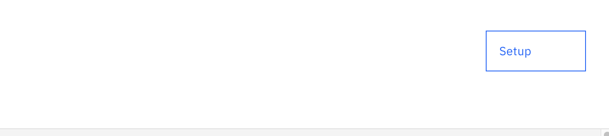
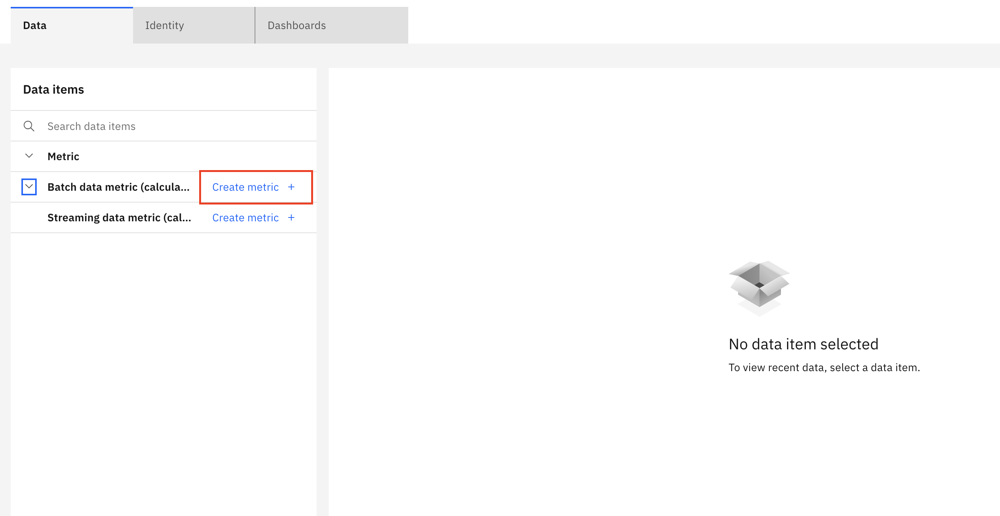
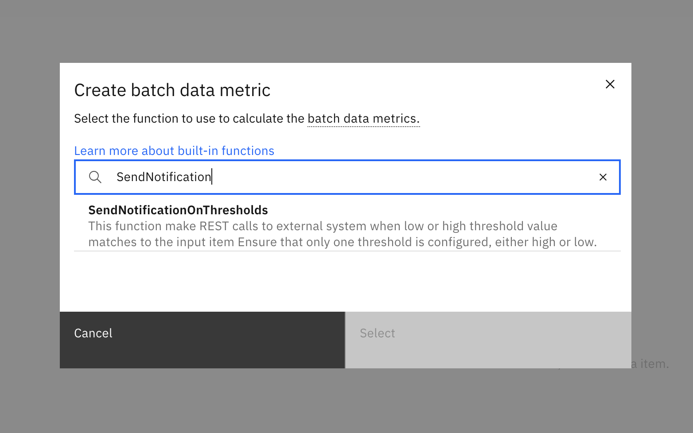
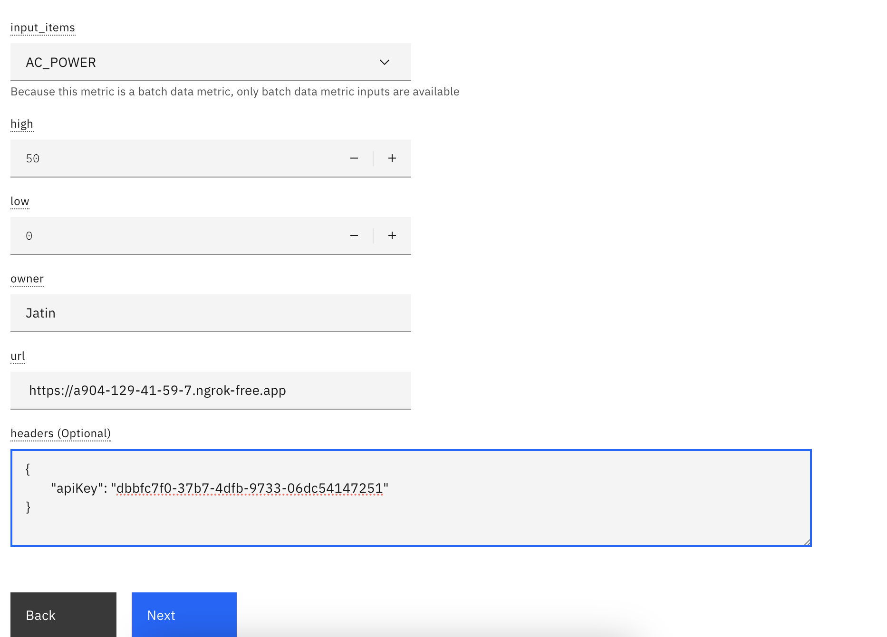
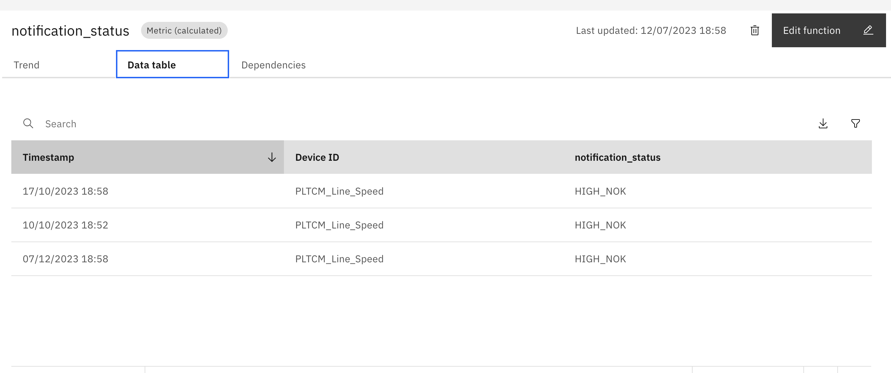

# Send alerts to external system from Maximo Monitor

Maximo Monitor, a powerful asset management monitoring tool, provides a comprehensive solution for monitoring various business processes, but sometimes, it's necessary to extend its capabilities to integrate with other systems. This is where a custom function that sends alerts to external systems by making REST calls comes into play.

This custom function enables organizations to configure high or low alerts and URLs to external systems, allowing them to receive notifications when alerts are generated in Maximo Monitor. This integration is particularly useful when external systems need to take action based on the alerts generated in Maximo Monitor. For instance, if an organization uses ServiceNow for incident management, they can configure the custom function to send alerts to ServiceNow, which will then trigger the appropriate incident management process.

## Configurations

### 1.Clone the custom function to your system

Create an empty GitHub directory. You need to place the custom function(which you will clone in next step) in this directory and need to push it into Github. You will use this directory to install custom function in Maximo Monitor.

Clone the directory  `maximo` into a folder on your local machine. You can do this using

```
git clone https://github.com/ibm-build-lab/maximo.git
```

make copy of `masmonitor-external-notification` directory to your newly created GitHub directory.

### 2. Update the credentials file

[Credentials](./resources/credentials.json) is config where we you need to add all the required details and API keys for connecting database and IoT application.

You need to contact administrator to get the database credentials. Refer [this link](https://www.ibm.com/docs/en/mas-cd/maximo-monitor/continuous-delivery?topic=reference-apis#accessing-rest-apis__title__3) to get the IoT `apiKey` and `apiToken`

If your instance is  using self signed certificate, then you need to get certificate file for DB2 and IoT connection. Refer [Credentials](./resources/credentials.json) file for more details.

Push code to your GitHub repository. Make sure you do not push credentials file to GitHub.

## Testing and Registering function

To test and register function, you can use notebook [Maximo Custom function Notebook](./resources/MAS%20Monitor.ipynb) which is present in this directory.

The Jupyter notebook contains code to test, register and unregister function. Once the function is generating desire output, you can register and use it in the Maximo Monitor.

## Configuring function in Maximo Monitor

Once the function is registered, follow below steps to use it in Maximo Monitor.

* Navigate to Maximo Monitor instance

* From the left navigation, click on `Monitor` menu
 

* Click on `Devices` tab and  select  the devices that you want to add the function to.

* Click on `Setup` button on top right, this will redirect you to Setup screen for device type you selected.


* Click On `Create metric` button for Batch data metric (Calculated)


* It will open dialog box containing in-built functions.

* Search for `SendNotification` and you will find your function registered there. Select and click on `Select` button.


* In function configuration screen, select desire scope of function. By default it is selected to `All devices of this type` and click on `Next`.

* In this screen, you need to select the input item on which function should run.
    * `input_item` is name of metric on which function should run
    * `high` is upper threshold value for which alert should be generated
    * `low` is lower threshold value for which alert should be generated.

    Ensure that you set value for either the high or low alert value; having both will be considered a high alert.

    * `owner` is name of user to whom alert should be assigned in external system.
    * `url` of external system to make rest call
    * `headers` is a optional key pair values in JSON format. If external system is required to authenticate with.


* Click on `Next` button.

* Give name of alert and click on `Create` button to complete the configuration.

* Wait for 5 minutes until job runs and it generates the output.

* View output by clicking on `Batch data metric (calculated)` in setup screen.

* Click on alert you have created. You may see results as below.



## Prerequisite
1. [Python 3.9.x](https://www.python.org/downloads/release/python-390/)
2. [GitHub](https://github.com/)
3. Maximo Monitor instance
