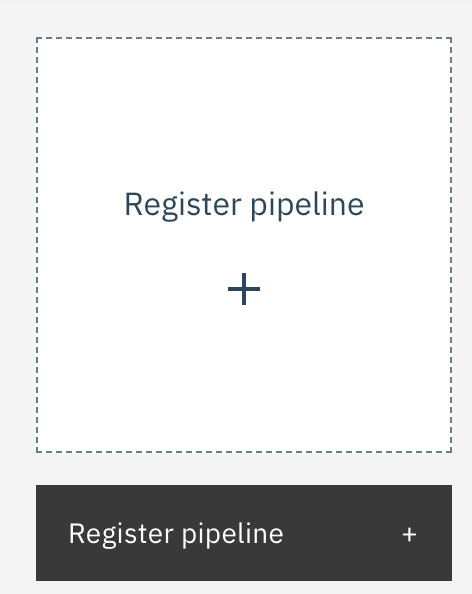
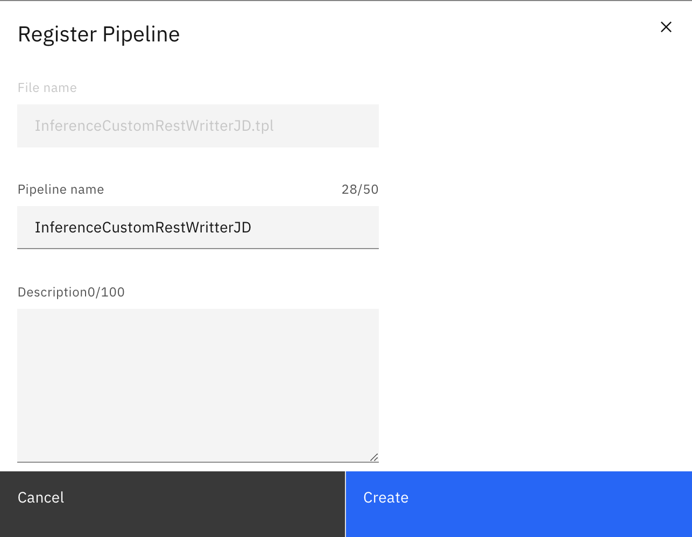
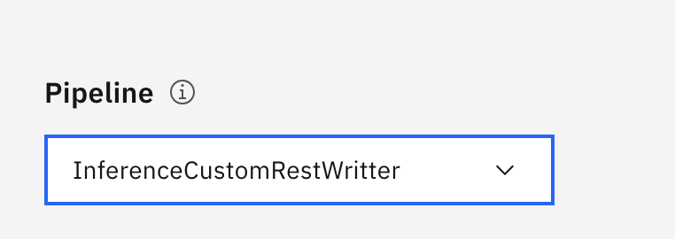

# Background

Maximo Visual Inspection Edge integrates with Maximo Visual Inspection to create inspections that collect images to train models or use trained models to identify objects in images. It allows users to create inspection rules that define pass or fail criteria. The solution collects or inspects images from input sources like fixed cameras at the edge of manufacturing activity.

Sometimes, you may need to send the inference results from MVI Edge to an external system. Assuming the external system has a REST API that can accept the inference results from MVI Edge for further processing.

In this tutorial we will be focusing on how to create custom pipeline and how we can configure it to make REST API call to send inference results.

# Pipelines

Pipelines in Maximo Visual Inspection Edge are sequences of **components** configured using JSON. When an inspection is created, the backend configuration employs a pipeline that outlines or extends the steps for processing images and populating inference results. In simple terms, a pipeline defines the workflow for handling input images and determining what actions to take with the inference output, such as storing results or cropping images.

Maximo Visual Inspection includes built-in pipelines like Folder Cropped and Camera Cropped.

# Prerequisites

- Maximo Visual Insection Edge
- Access to the Machine where Maximo Visual Insection Edge is installed

# Creating custom pipeline

As previously mentioned, a pipeline is a sequence of components. To meet our requirement, we need to create a component configured to our endpoint, enabling it to make REST calls to our external system. Therefore, we need to first create this component.

# Step 1: Create Component

Login to machine where MVI Edge is installed. It is recommaned that you have root access to that machine. 

If you have virtual machine, you can make use of below commmand to login to the machine.

`ssh -i path-to-private-key root@server-ip`

In above command, `path-to-private-key` is path to ssh private private key and `server-ip` is server's IP address.

After successfully logged in, navigate to `<INSTALL_ROOT>/vision-edge/volume/run/var/config/templates/components` directory

Here you will find list of default components which are being used in other pipelines. To create a new component, we need to create a component file in `components` directory.

Before creating file, copy or download content from [InferenceCustomRESTWriterComponent.tpl](InferenceCustomRESTWriterComponent.tpl) file and update the `url` and `header` as per your REST API definition.

To create a file, enter `cat > InferenceCustomRESTWriterComponent.tpl` in terminal and paste content of [InferenceCustomRESTWriterComponent.tpl](InferenceCustomRESTWriterComponent.tpl) file. Make sure to update the the `url` and `header` as per your REST API definition.

Enter `CTRL-D` to save and exit.

If you see content of [InferenceCustomRESTWriterComponent.tpl](InferenceCustomRESTWriterComponent.tpl), since what we have done is, we have created component named `inferencecustomrestwriter` which make REST call to url defined in the same file. We will use this component file in pipeline which we are going to create in up coming steps.

Exit from the virtual server.

# Step 2: Download the default pipeline

- Open Maximo Visual Inspection Edge and navigate to **Settings -> Pipelines**
- Open a default pipeline and then click the Export icon. The exported Go template is your custom pipeline template.
- Rename the pipeline and give it name **InferenceCustomRestWritterYOUR-INITIALS.tpl**
- Replace `YOUR-INITIALS` in file name by initials of your name. e.g. **InferenceCustomRestWritterJD.tpl**

# Step 3: Custom pipeline

Now open a file **InferenceCustomRestWritterYOUR-INITIALS.tpl** you just renamed in any preferred editor and replace the content with content of [InferenceCustomRestWritter.tpl](InferenceCustomRestWritter.tpl) file.

If you see the content, you will find that we have make you of **inferencecustomrestwriter** component in our pipeline.

Save the file.

# Step 4: Register the pipeline

- Navigate **Settings -> Pipelines** in MVI Edge.
- Click on Register Pipeline

- Upload a pipeline file that you have create. Which is **InferenceCustomRestWritterYOUR-INITIALS.tpl**

- Click on **Create** button

Your pipeline is created successfully.

# Step 4: Use custom pipeline in inspection

- Navigate to inspections in MVI Edge.
- Open inspection configuration
- In the pipeline select the custom pipeline which you have registered.

- Enable the inspection

Upon the infererecing the images, you should be receving the inference result to your endpoint which you have configured in **InferenceCustomRESTWriterComponent.tpl** file.
